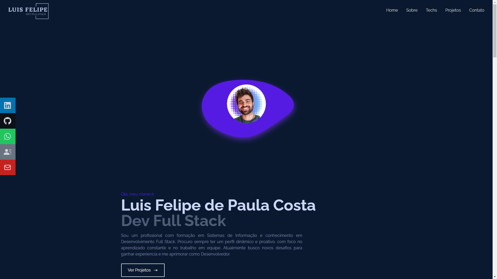

<h1 align="center"> Coffe Delivery </h1>

  Voce pode encontrar demo do projeto no github pages nesse <a href="https://lupebreak.github.io">Link</a>

  <a href="#-tecnologias">Tecnologias</a>&nbsp;&nbsp;&nbsp;|&nbsp;&nbsp;&nbsp;
  <a href="#-projeto">Projeto</a>&nbsp;&nbsp;&nbsp;|&nbsp;&nbsp;&nbsp;
  <a href="#memo-licença">Licença</a>

 

  

## 🚀 Tecnologias

Esse projeto foi desenvolvido com as seguintes tecnologias:

- Javascript
- React
- TailwindCSS
- Git e Github

## 💻 Projeto

Esse é um pequeno projeto de um site portfolio utilizando ReactJs e TailwindCSS.

Fique a vontade para reutilizar o projeto.

---

Feito com ♥ by [LuPeBreak](https://github.com/LuPeBreak/)!
